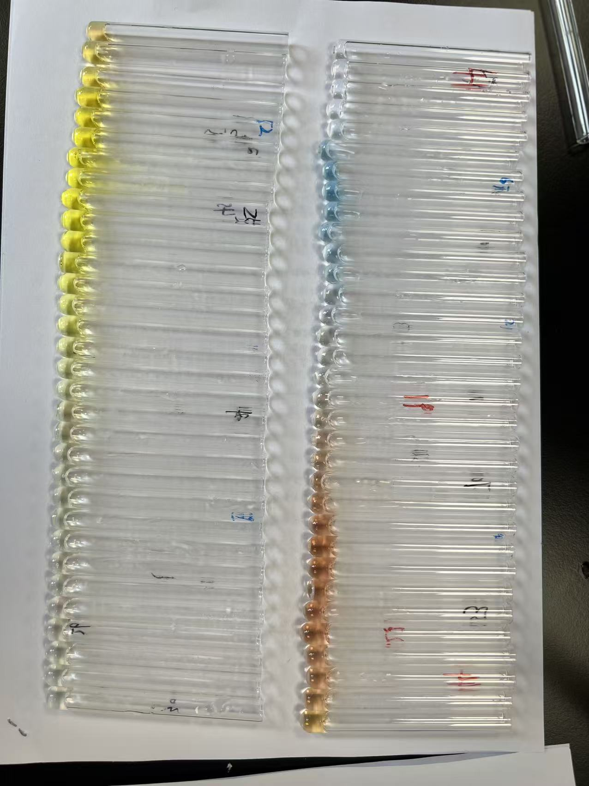
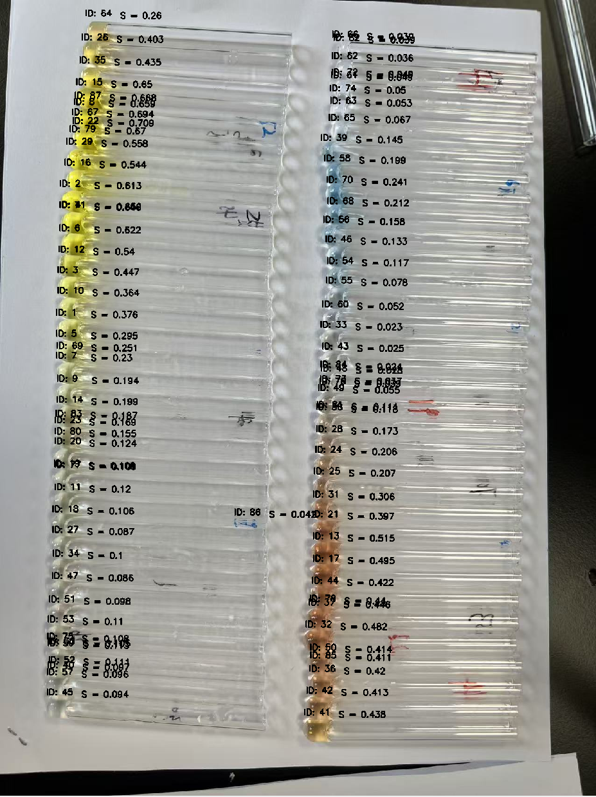

# YOtube

The footscript is a task-oriented project. The logic is based on our paper (accepted but not published yet) that validates the function of saturation in precisely and robustly representing concentration of biochem samples merely through images. However, image analysis is usally done manually by human, whose efficiency is extremely low. That's the reason for us to automate the process by YOLO.

We train a model using YOLOv8 and labeling and annotating are finished through Roboflow. Data are available here. When infering, the programme extract RGB value of each tube detected and calculate its saturation.

## Demo

This picture is taken in our experiment, and the solution is composed of three different components with distinct color, seperated through chromatography.

Run inference.py and select it as input. The result will be shown in the image and saved to a csv.

